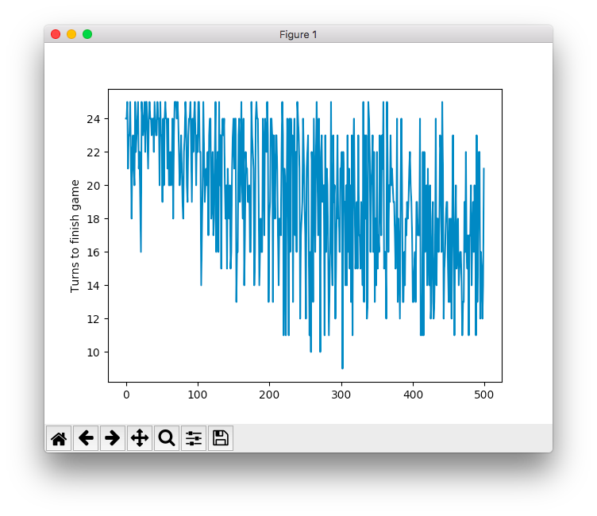

# Battleship AI (BSAI)

Rapidly developed a text based battleship game engine and reinforcement learning based AI to play it.

## Getting Started

    0. Clone the repo.
    1. Play the game.

game.py contains all the necessary code to instantiate and run a game of battleship. The only dependency outside of the python standard library is numpy.

There is a basic command line interface to instantiate games.

Single player human game ("Battleship solitaire"):
```
$ python3 game.py --players Human
```

Two player AI vs. AI:
```
$ python3 game.py --players AI AI
```
Three player AI vs. Human vs. AI ("The AI sandwich"):
```
$ THREE PLAYER BATTLESHIP... WAT?
```
The AI in standard games plays completely at random. Hopefully you can beat it.

## Reinforcement Learning AI

The goal was to build an AI using reinforcement learning with Keras + Tensorflow.

This post https://edersantana.github.io/articles/keras_rl/ was used a a starting point for this, with the https://ai.intel.com/demystifying-deep-reinforcement-learning/ helping to gain a better understanding of underlying models.

There are some important differences between Battleship and the game of Catch the article uses, the primary one being that rewards happen immediately after each move (alleviating the credit assignment problem) and the a snapshot of the board state provides all of the necessary information (eliminating the need for storing memory of previous states and exploring long time horizon strategies).

Dependencies include numpy, matplotlib, keras, and tensorflow. The full list of packages I have installed in the venv (Don't use virtualenv or matplotlib wont work...) can be seen below:

```
$ pip3 freeze
absl-py==0.2.2
astor==0.7.1
cycler==0.10.0
gast==0.2.0
grpcio==1.13.0
h5py==2.8.0
Keras==2.2.0
Keras-Applications==1.0.2
Keras-Preprocessing==1.0.1
kiwisolver==1.0.1
Markdown==2.6.11
matplotlib==2.2.2
numpy==1.14.5
protobuf==3.6.0
pyparsing==2.2.0
python-dateutil==2.7.3
pytz==2018.5
PyYAML==3.13
scipy==1.1.0
six==1.11.0
tensorboard==1.9.0
tensorflow==1.9.0
termcolor==1.1.0
Werkzeug==0.14.1
```
To run train the ai, run:
```
$ python3 ai.py
```
While not great, the AI does perform better than a completely random strategy (Red = Random, Blue = AI):


(In this case, attempting to shoot at the same square multiple times still counts as a turn, causing some very high turn counts occasionally)

It also clearly improves over time as it plays:



(In this case, the AI is forced to generate valid moves for a 5x5 grid which caps the number of turns at 25)

Unfortunately the integration with this AI back in to the Battleship isn't complete, so you can't play games against the fully trained model or easily evaluate its performance. Also, the underlying model (a few full connected hidden layers...) could certainly be improved upon. Maybe at some point.

## Configurable rules based AI

I also implemented a simpler AI that explores the board looking for hits, generates potential moves nearby, and evaluates those moves based on analysis of the local region. This version of the AI is integrated back into the game itself and has the hooks to be configured upon instantiation via an external .ini file.

The game can also be run in a batch mode to evaluate AI performance. To run a batch of games you can run:

```
$ python3 test.py
```
This script has examples of running a batch for a single AI (to evaluate average number of turns to clear the board) or head to head games (to evaluate performance against another approach). Below is a plot of one AI configuration (blue) playing 100 games against a completely random AI (red).


(You can see the AI beat Random 97/100 games)

A completely random AI on average took ~61 moves to clear the board, while the various configurations of the rules based approach tended to take ~47 moves. Tuning the parameters for how moves were evaluated only didn't impact the performance much (+/- 1 move or so).

Also, adding a bit of randomness (i.e. 10% take a random shot to help explore uncharted territory decreased performance).

I think that is all there is to say for now... cheers!
